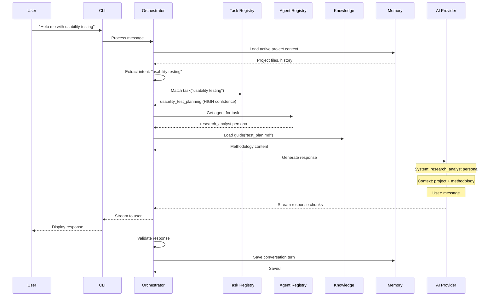
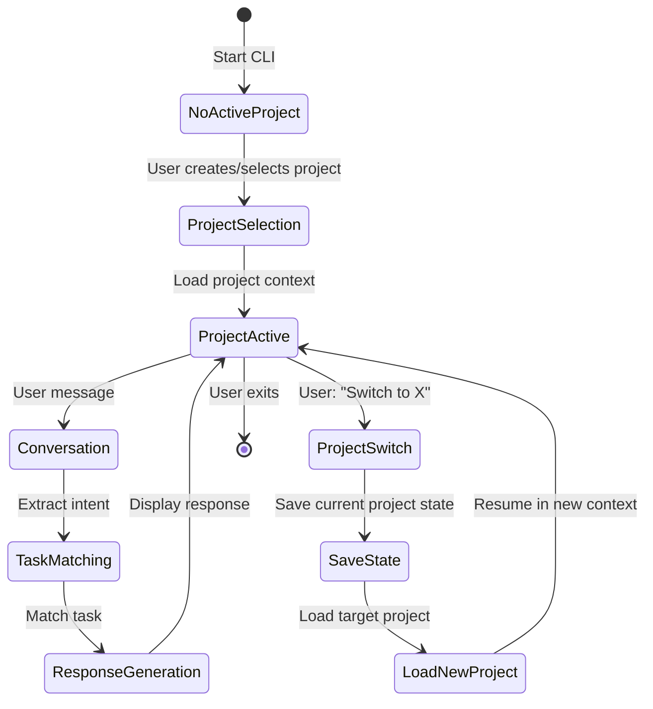
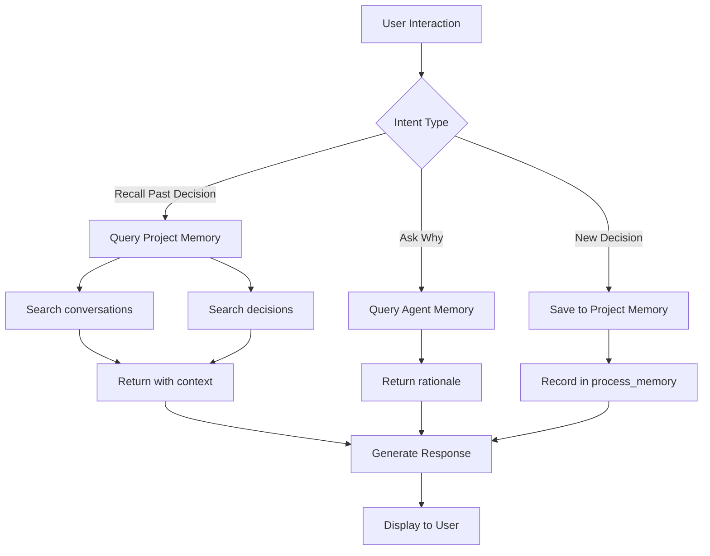

# Product Design Agent: Architecture Design for CLI Implementation

**Date:** 2025-11-10
**Purpose:** Blueprint for transforming from context-dependent web agent to independent CLI implementation

---

## Executive Summary

This document defines the architecture for the Product Design Agent's transformation from a Claude Desktop/Gemini Gems dependent implementation to an independent CLI-based system running via Claude Code CLI (OAuth) or Gemini CLI (OAuth) as AI providers.

**Core Design Principles:**
- **Preserve the soul:** Maintain conversational dynamics and behavioral patterns
- **Add memory:** Three-tier architecture (agent/project/registry)
- **Enable multi-project:** Users work on multiple projects with isolated contexts
- **Pure conversation:** Natural language only, no commands
- **Provider independence:** Abstract AI provider layer for future extensibility
- **Five Cornerstones:** Configurability, Modularity, Extensibility, Integration, Automation

---

## 1. High-Level Architecture

### 1.1 System Overview

```
┌─────────────────────────────────────────────────────────────────┐
│                         USER                                     │
│                  (Natural Language Input)                        │
└────────────────────────────┬────────────────────────────────────┘
                             │
                             ▼
┌─────────────────────────────────────────────────────────────────┐
│                    INTERFACE LAYER                               │
│  ┌──────────────┐         ┌──────────────┐                      │
│  │  CLI Shell   │         │  Web UI      │ (Future)             │
│  │              │         │  (Streaming) │                      │
│  └──────────────┘         └──────────────┘                      │
└────────────────────────────┬────────────────────────────────────┘
                             │
                             ▼
┌─────────────────────────────────────────────────────────────────┐
│                   ORCHESTRATION ENGINE                           │
│  ┌────────────────────────────────────────────────────────────┐ │
│  │  Conversation Manager                                       │ │
│  │  - Session state                                            │ │
│  │  - Context window management                                │ │
│  │  - Multi-turn conversation threading                        │ │
│  └────────────────────────────────────────────────────────────┘ │
│                             │                                    │
│  ┌────────────────────────────────────────────────────────────┐ │
│  │  Workflow Orchestrator                                      │ │
│  │  - Intent extraction                                        │ │
│  │  - Task matching & confidence scoring                       │ │
│  │  - Agent selection                                          │ │
│  │  - Knowledge loading                                        │ │
│  │  - Response synthesis                                       │ │
│  │  - Validation loop                                          │ │
│  └────────────────────────────────────────────────────────────┘ │
└────────────────────────────┬────────────────────────────────────┘
                             │
            ┌────────────────┼────────────────┐
            │                │                │
            ▼                ▼                ▼
┌─────────────────┐  ┌──────────────┐  ┌─────────────────┐
│  AGENT REGISTRY │  │ TASK REGISTRY│  │ KNOWLEDGE BASE  │
│                 │  │              │  │                 │
│  agents.yaml    │  │ tasks.yaml   │  │ task_guides/    │
│  - 12 personas  │  │ - 80+ tasks  │  │ materials/      │
│  - Workflows    │  │ - Matching   │  │ - Embeddings    │
│  - Handoffs     │  │ - Confidence │  │ - Semantic      │
└─────────────────┘  └──────────────┘  └─────────────────┘
            │                │                │
            └────────────────┼────────────────┘
                             │
                             ▼
┌─────────────────────────────────────────────────────────────────┐
│                      MEMORY LAYER                                │
│  ┌─────────────────────────────────────────────────────────────┐│
│  │  AGENT MEMORY (Global)                                       ││
│  │  - Methodology knowledge (from files)                        ││
│  │  - Operating procedures                                      ││
│  │  - Process learnings (why decisions were made)               ││
│  │  - Internal state                                            ││
│  └─────────────────────────────────────────────────────────────┘│
│  ┌─────────────────────────────────────────────────────────────┐│
│  │  PROJECT MEMORY (Per-Project, Isolated)                     ││
│  │  ┌─────────────────────────────────────────────────────────┐││
│  │  │ Project: "Mobile App Redesign"                           │││
│  │  │ - Conversation history (searchable)                      │││
│  │  │ - Uploaded files & context                               │││
│  │  │ - Decisions & rationale                                  │││
│  │  │ - User preferences (project-specific)                    │││
│  │  │ - Session state                                          │││
│  │  └─────────────────────────────────────────────────────────┘││
│  │  ┌─────────────────────────────────────────────────────────┐││
│  │  │ Project: "Enterprise Dashboard"                          │││
│  │  │ - Conversation history                                   │││
│  │  │ - ...                                                    │││
│  │  └─────────────────────────────────────────────────────────┘││
│  └─────────────────────────────────────────────────────────────┘│
│  ┌─────────────────────────────────────────────────────────────┐│
│  │  PROJECT REGISTRY (Metadata)                                 ││
│  │  - Project list & identifiers                                ││
│  │  - Last accessed timestamps                                  ││
│  │  - Active project pointer                                    ││
│  └─────────────────────────────────────────────────────────────┘│
└────────────────────────────┬────────────────────────────────────┘
                             │
                             ▼
┌─────────────────────────────────────────────────────────────────┐
│                    AI PROVIDER LAYER                             │
│  ┌──────────────────┐      ┌──────────────────┐                 │
│  │  Claude Adapter  │      │  Gemini Adapter  │                 │
│  │  (OAuth CLI)     │      │  (OAuth CLI)     │                 │
│  └──────────────────┘      └──────────────────┘                 │
│            │                         │                           │
│            ▼                         ▼                           │
│  ┌──────────────────┐      ┌──────────────────┐                 │
│  │  Claude Code CLI │      │  Gemini CLI      │                 │
│  │  (subprocess)    │      │  (subprocess)    │                 │
│  └──────────────────┘      └──────────────────┘                 │
└─────────────────────────────────────────────────────────────────┘
```

### 1.2 Core Components

| Component | Responsibility | Technology |
|-----------|---------------|------------|
| **Interface Layer** | User interaction (CLI, future Web UI) | TBD (Deno/Go) |
| **Orchestration Engine** | Workflow execution, validation, context management | TBD |
| **Agent Registry** | Load agent personas, workflows | YAML parser |
| **Task Registry** | Task matching, confidence scoring | YAML parser + search |
| **Knowledge Base** | On-demand guide loading, semantic search | Files + embeddings |
| **Memory Layer** | Persistent state (agent/project/registry) | SQLite (embedded) |
| **AI Provider Layer** | Abstract LLM access via CLI | Subprocess execution |

---

## 2. Detailed Component Design

### 2.1 Interface Layer: CLI Shell

**Requirements:**
- Pure conversational interaction (natural language only)
- Multi-turn conversation support
- Project switching via natural language
- Response streaming (for long responses)
- Interrupt/cancel support
- History/search within session

**User Experience:**
```
$ design-agent

Product Design Agent v1.0
Type 'help' for guidance or just start talking.

You: I'm starting a new project for mobile checkout redesign

Agent: Great! Let's set up a new project. What would you like to call it?

You: Call it "Mobile Checkout"

Agent: Perfect. "Mobile Checkout" project created.

To help me understand your context, could you tell me:
- Who are the target users?
- What's the main problem you're trying to solve?
- Any constraints (timeline, budget, technical)?

Or you can upload a project brief and I'll extract the context.

You: [uploads file]

Agent: Thanks! I've analyzed your brief. I see:
- Target: Retail app users ages 25-45
- Problem: 60% cart abandonment in checkout
- Constraint: 6-week timeline, no budget for external research
- Goal: Reduce abandonment to <30%

I'd recommend we start with journey mapping to identify friction points,
then run low-cost usability testing. Should we start there?

You: Yes, let's map the journey

Agent: [Loads journey_mapping task, discovery_analyst persona]
       [Generates contextualized journey mapping guidance...]
```

**Technical Implementation:**
- REPL (Read-Eval-Print-Loop) for conversation
- Session persistence (auto-save state)
- Project context loaded on startup
- Graceful exit (save state)

### 2.2 Orchestration Engine

#### 2.2.1 Conversation Manager

**Responsibilities:**
- Maintain conversation thread
- Manage context window (limit to provider's constraints)
- Prioritize context (recent messages + project files + relevant knowledge)
- Handle turn-taking (user → agent → user)

**Context Window Strategy:**
```
Priority Levels:
1. Current turn (user's latest message) - ALWAYS included
2. Project context (uploaded files, key decisions) - HIGH priority
3. Recent conversation (last N turns) - MEDIUM priority
4. Agent persona & operating procedures - HIGH priority
5. Task methodology (loaded just-in-time) - HIGH priority
6. Historical conversation (searchable, loaded on-demand) - LOW priority
```

**Optimization:**
- Summarize old conversations (compress to key points)
- Load historical context only when referenced
- Use embeddings to find relevant past discussions

#### 2.2.2 Workflow Orchestrator

**Responsibilities:**
- Execute the 8-step workflow (from BEHAVIORAL_PATTERNS.md)
- Implement validation loop
- Handle error cases gracefully
- Coordinate between registries and memory

**Workflow Implementation:**

```
Step 0: User Preference Detection
├─ Check project memory for user_preferences
└─ Apply overrides or use defaults

Step 1: Context Awareness
├─ Load active project from Project Registry
├─ Retrieve project files from Project Memory
└─ Extract goals, constraints, terminology

Step 2: Intent Extraction
├─ Parse user message for keywords
├─ Detect language (EN/ES)
└─ Connect to project context

Step 3: Task Matching
├─ Query Task Registry with keywords
├─ Calculate confidence scores (HIGH/MEDIUM/LOW)
├─ Apply fuzzy matching if needed
└─ Return matched task(s) or trigger error handling

Step 4: Agent Selection
├─ Load agent persona from Agent Registry
├─ Load: role, goal, backstory, capabilities, tools, operating_procedures
└─ Prepare agent context for LLM

Step 5: Knowledge Loading
├─ Load task_guide(s) from Knowledge Base
├─ Load materials if referenced
├─ Optionally: semantic search for related knowledge
└─ Prepare methodology context

Step 6: Response Synthesis
├─ Construct LLM prompt:
│  ├─ System: Agent persona + operating procedures + instructions
│  ├─ Context: Project files + conversation history + task methodology
│  └─ User: Current message + preferences
├─ Call AI Provider (Claude/Gemini CLI)
├─ Stream response back to user
└─ Parse response

Step 7: Validation Loop
├─ Run 10-point checklist programmatically:
│  1. Context integrated? (check if project context mentioned)
│  2. Task methodology applied? (check if guide concepts present)
│  3. Confidence assessed? (check if uncertainty noted where applicable)
│  4. Limitations noted? (check if gaps acknowledged)
│  5. Citations included? (check for source references)
│  6. Project alignment? (check terminology consistency)
│  7-10. [Additional checks based on task type]
├─ IF validation fails: Log issues, optionally retry or flag
└─ IF validation passes: Proceed to delivery

Step 8: Delivery & Memory Update
├─ Return response to user via Interface Layer
├─ Save conversation turn to Project Memory
├─ Update session state
└─ Prepare for next turn
```

**Error Handling Integration:**
```
IF no task match (confidence < 50%):
  ├─ Analyze project context to infer need
  ├─ Semantic search Knowledge Base for related concepts
  ├─ Decompose complex request into sub-tasks
  ├─ Present alternatives to user
  └─ Admit limitation if no path forward

IF ambiguous request:
  ├─ Identify multiple interpretations
  ├─ Present options to user
  └─ Wait for clarification

IF missing critical context:
  ├─ Flag what's missing
  ├─ Explain why it matters
  └─ Proceed with noted assumptions OR wait for input
```

### 2.3 Agent Registry Service

**Data Structure (Loaded from agents.yaml):**
```typescript
interface Agent {
  id: string;
  role: {
    en: string;
    es: string;
  };
  goal: string;
  backstory: string;
  capabilities: string[];
  tools: string[];
  operating_procedures: string[];
  handoffs: {
    to: { agent: string; deliverable: string }[];
    from: { agent: string; input: string }[];
  };
  example_tasks: string[];
}
```

**API:**
```typescript
class AgentRegistry {
  loadAgents(): Agent[];
  getAgentById(id: string): Agent | null;
  getAgentForTask(taskId: string): Agent | null;
  formatAgentPrompt(agent: Agent): string; // For LLM system prompt
}
```

**Usage:**
```typescript
const agent = agentRegistry.getAgentForTask("brainstorming");
// Returns: strategy_analyst

const promptContext = agentRegistry.formatAgentPrompt(agent);
// Returns formatted text for LLM:
// "You are a Strategy Analyst. Your goal is to translate opportunities
//  into coherent product/design strategies with measurable outcomes.
//  Your operating procedures: 1) Clarify objectives → choose approach..."
```

### 2.4 Task Registry Service

**Data Structure (Loaded from tasks.yaml):**
```typescript
interface Task {
  task_id: string;
  description: string;
  expected_output: string;
  task_guide: string[];
  materials?: string[];
  agent: string;
}
```

**API:**
```typescript
class TaskRegistry {
  loadTasks(): Task[];
  matchTask(keywords: string[], projectContext?: string): TaskMatch;
  getTaskById(id: string): Task | null;
}

interface TaskMatch {
  task: Task;
  confidence: 'HIGH' | 'MEDIUM' | 'LOW';
  score: number; // 0-100
  alternates?: Task[]; // If MEDIUM/LOW confidence
}
```

**Matching Algorithm:**
```
1. Exact keyword match in task_id or description
   → HIGH confidence (score: 80-100)

2. Fuzzy keyword match (Levenshtein distance)
   → MEDIUM confidence (score: 50-80)

3. Semantic search via embeddings (if implemented)
   → MEDIUM/LOW confidence (score: 30-80)

4. No match
   → Trigger error handling workflow
```

### 2.5 Knowledge Base Service

**Structure:**
```
knowledge/
├── task_guides/       # 64 markdown files
├── materials/         # 11 template/data files
└── embeddings/        # (New) Vector embeddings for semantic search
    ├── guides.index
    └── metadata.json
```

**API:**
```typescript
class KnowledgeBase {
  loadGuide(filename: string): string;
  loadMaterial(filename: string): string;
  semanticSearch(query: string, topK: number): SearchResult[];
  chunkGuide(guide: string): Chunk[]; // For embedding generation
}

interface SearchResult {
  filename: string;
  chunk: string;
  relevance: number; // 0-1
}
```

**Embedding Strategy:**
```
1. On initialization:
   ├─ Chunk all task guides into ~500-word segments
   ├─ Generate embeddings for each chunk (via provider API or local model)
   ├─ Store in local vector index (e.g., using FAISS or simple cosine similarity)
   └─ Cache for fast retrieval

2. On semantic search:
   ├─ Generate embedding for query
   ├─ Find top-K most similar chunks
   └─ Return relevant guide sections
```

**Usage Patterns:**
- **Exact loading:** When task matched, load specific guide(s)
- **Semantic search:** When no exact match, find related content
- **Context enrichment:** Find related guides for deeper context

### 2.6 Memory Layer

#### 2.6.1 Agent Memory (Global)

**Purpose:** Store agent's internal knowledge and process learnings

**Schema (SQLite):**
```sql
-- Process memory: Why decisions were made
CREATE TABLE process_memory (
  id INTEGER PRIMARY KEY,
  timestamp TEXT,
  context TEXT,              -- What was happening
  decision TEXT,             -- What was decided
  rationale TEXT,            -- Why it was decided
  outcome TEXT,              -- What happened as a result
  lessons TEXT               -- What was learned
);

-- Internal state: Agent configuration
CREATE TABLE agent_state (
  key TEXT PRIMARY KEY,
  value TEXT
);
```

**API:**
```typescript
class AgentMemory {
  recordDecision(decision: Decision): void;
  queryDecisions(query: string): Decision[];
  getLesson(context: string): Lesson | null;
}
```

**Usage:**
When agent helps make a decision:
```
User: Should we do moderated or unmoderated testing?
Agent: [Provides analysis, user chooses moderated]

→ Save to process_memory:
   - decision: "Moderated usability testing"
   - rationale: "User wanted to probe deeply into navigation issues,
                 budget allowed for 5 sessions"
   - context: "Mobile Checkout project, week 2, testing planning phase"
```

Later:
```
User: Why did we go with moderated testing?
Agent: [Queries process_memory, retrieves decision + rationale]
       "We chose moderated testing because you wanted to probe deeply
        into navigation issues, and the budget supported 5 sessions."
```

#### 2.6.2 Project Memory (Per-Project)

**Purpose:** Store all project-specific context and conversations

**Schema (SQLite):**
```sql
-- Projects registry
CREATE TABLE projects (
  id TEXT PRIMARY KEY,
  name TEXT,
  created_at TEXT,
  last_accessed TEXT,
  is_active BOOLEAN
);

-- Conversation history
CREATE TABLE conversations (
  id INTEGER PRIMARY KEY,
  project_id TEXT,
  timestamp TEXT,
  role TEXT,                 -- 'user' or 'agent'
  message TEXT,
  task_id TEXT,              -- Which task was active
  agent_id TEXT,             -- Which agent persona was active
  FOREIGN KEY (project_id) REFERENCES projects(id)
);

-- Project files
CREATE TABLE project_files (
  id INTEGER PRIMARY KEY,
  project_id TEXT,
  filename TEXT,
  content TEXT,              -- File contents
  uploaded_at TEXT,
  file_type TEXT,            -- 'brief', 'research', 'design', etc.
  FOREIGN KEY (project_id) REFERENCES projects(id)
);

-- Project decisions
CREATE TABLE project_decisions (
  id INTEGER PRIMARY KEY,
  project_id TEXT,
  timestamp TEXT,
  decision TEXT,
  rationale TEXT,
  conversation_id INTEGER,   -- Link to conversation where decided
  FOREIGN KEY (project_id) REFERENCES projects(id),
  FOREIGN KEY (conversation_id) REFERENCES conversations(id)
);

-- Project metadata
CREATE TABLE project_metadata (
  project_id TEXT,
  key TEXT,
  value TEXT,
  PRIMARY KEY (project_id, key),
  FOREIGN KEY (project_id) REFERENCES projects(id)
);
```

**API:**
```typescript
class ProjectMemory {
  // Project management
  createProject(name: string): Project;
  getProject(id: string): Project | null;
  listProjects(): Project[];
  switchProject(id: string): void;
  deleteProject(id: string): void;

  // Conversation
  saveConversationTurn(projectId: string, turn: ConversationTurn): void;
  getConversationHistory(projectId: string, limit?: number): ConversationTurn[];
  searchConversations(projectId: string, query: string): ConversationTurn[];

  // Files
  uploadFile(projectId: string, file: File): void;
  getProjectFiles(projectId: string): File[];

  // Decisions
  recordDecision(projectId: string, decision: Decision): void;
  searchDecisions(projectId: string, query: string): Decision[];

  // Metadata
  setMetadata(projectId: string, key: string, value: any): void;
  getMetadata(projectId: string, key: string): any;
}
```

**Conversation Search:**
```typescript
// Semantic search over conversation history
searchConversations(projectId, "navigation decision")
  → Returns conversations mentioning navigation decisions
  → Uses embeddings or keyword search
```

#### 2.6.3 Project Registry (Metadata)

**Purpose:** Track all projects, enable quick switching

**Schema (part of projects table above):**
```sql
CREATE TABLE projects (
  id TEXT PRIMARY KEY,
  name TEXT,
  created_at TEXT,
  last_accessed TEXT,
  is_active BOOLEAN
);
```

**API:**
```typescript
class ProjectRegistry {
  getActiveProject(): string | null;
  setActiveProject(id: string): void;
  recentProjects(limit: number): Project[];
}
```

**Usage:**
```typescript
// At startup
const activeProject = projectRegistry.getActiveProject();
if (activeProject) {
  projectMemory.switchProject(activeProject);
  // Load project context into conversation
}

// Project switching
user: "Switch to Mobile Checkout"
  → projectRegistry.setActiveProject("mobile-checkout")
  → Load project memory
  → Acknowledge: "Switched to Mobile Checkout. Last conversation: ..."
```

### 2.7 AI Provider Layer

**Purpose:** Abstract LLM access, enable provider switching

**Interface:**
```typescript
interface AIProvider {
  name: string;
  initialize(): Promise<void>;
  generateResponse(prompt: ProviderPrompt): AsyncIterator<string>; // Streaming
  getContextLimit(): number;
}

interface ProviderPrompt {
  system: string;       // Agent persona + instructions
  context: string[];    // Project context, conversation history, methodology
  user: string;         // Current user message
}
```

**Implementations:**

**Claude Code CLI Adapter:**
```typescript
class ClaudeAdapter implements AIProvider {
  name = "Claude";
  contextLimit = 200000; // tokens

  async initialize() {
    // Verify claude CLI is installed and authenticated (OAuth)
    await exec("claude --version");
  }

  async *generateResponse(prompt: ProviderPrompt) {
    // Construct prompt for Claude Code CLI
    const fullPrompt = this.formatPrompt(prompt);

    // Execute Claude Code CLI as subprocess
    const process = spawn("claude", ["--stream", ...args]);

    // Stream output
    for await (const chunk of process.stdout) {
      yield chunk.toString();
    }
  }

  private formatPrompt(prompt: ProviderPrompt): string {
    // Format for Claude's expected input
    return `${prompt.system}\n\n${prompt.context.join('\n\n')}\n\nUser: ${prompt.user}\n\nAssistant:`;
  }
}
```

**Gemini CLI Adapter:**
```typescript
class GeminiAdapter implements AIProvider {
  name = "Gemini";
  contextLimit = 1000000; // tokens

  async initialize() {
    await exec("gemini --version");
  }

  async *generateResponse(prompt: ProviderPrompt) {
    // Similar to Claude, but with Gemini CLI
    const process = spawn("gemini", ["text", "-p", fullPrompt]);
    for await (const chunk of process.stdout) {
      yield chunk.toString();
    }
  }
}
```

**Provider Registry:**
```typescript
class ProviderRegistry {
  providers: Map<string, AIProvider>;
  activeProvider: AIProvider;

  register(provider: AIProvider): void;
  setActive(name: string): void;
  getActive(): AIProvider;
}
```

**Usage:**
```typescript
// At startup
providerRegistry.register(new ClaudeAdapter());
providerRegistry.register(new GeminiAdapter());
providerRegistry.setActive("Claude"); // Default or user preference

// In conversation
const response = providerRegistry.getActive().generateResponse(prompt);
for await (const chunk of response) {
  console.write(chunk); // Stream to user
}
```

---

## 3. Workflow Diagrams

### 3.1 Single-Turn Conversation Flow



### 3.2 Multi-Project Workflow



### 3.3 Memory Architecture Interaction



---

## 4. Multi-Project Support Design

### 4.1 Project Lifecycle

**Creating a Project:**
```
User: "I'm starting a new mobile checkout project"

Agent: [Detects intent: new project]
       "Great! Let's create a new project. What would you like to call it?"

User: "Mobile Checkout Redesign"

Agent: → Creates project in Project Registry
       → Sets as active project
       → Initializes Project Memory
       "Project 'Mobile Checkout Redesign' created and activated.
        Would you like to upload a project brief or describe the context?"
```

**Switching Projects:**
```
User: "Switch to Enterprise Dashboard"

Agent: → Saves current project state
       → Loads "Enterprise Dashboard" project from registry
       → Retrieves last conversation context
       "Switched to 'Enterprise Dashboard' project.
        Last conversation: 2 days ago, we discussed navigation patterns.
        You uploaded updated wireframes since then.
        Should we review those, or continue with navigation?"
```

**Listing Projects:**
```
User: "What projects do I have?"

Agent: "You have 3 projects:
        1. Mobile Checkout Redesign (active, last accessed today)
        2. Enterprise Dashboard (last accessed 2 days ago)
        3. Marketing Website Refresh (last accessed 1 week ago)

        Would you like to switch to a different project?"
```

**Deleting a Project:**
```
User: "Delete the Marketing Website project"

Agent: "Are you sure you want to delete 'Marketing Website Refresh'?
        This will remove:
        - 47 conversation turns
        - 3 uploaded files
        - 8 recorded decisions

        This cannot be undone."

User: "Yes, delete it"

Agent: → Removes from Project Registry
       → Deletes from Project Memory
       "Project deleted."
```

### 4.2 Project Isolation

**Design Principle:** Each project has completely isolated context.

**Enforcement:**
- All Project Memory queries scoped by project_id
- Conversation history never crosses projects
- Uploaded files belong to single project
- Decisions are project-specific

**Cross-Project Learning (Optional):**
```
User: "Did I solve a similar problem in another project?"

Agent: [Queries across ALL projects]
       "Yes, in 'Enterprise Dashboard' you faced a similar navigation
        challenge. You decided on a sidebar navigation because your users
        preferred hierarchical access. Would you like me to retrieve
        that discussion?"
```

**Implementation:**
```typescript
// Project-scoped query (default)
projectMemory.searchConversations("mobile-checkout", "navigation")
  → Only searches Mobile Checkout conversations

// Cross-project query (explicit)
projectMemory.searchAllProjects("navigation decision")
  → Searches all projects, groups results by project
```

---

## 5. Technical Decisions & Trade-offs

### 5.1 Storage: SQLite (Embedded)

**Why SQLite:**
- ✓ Embedded (no separate database server)
- ✓ Single-file database (easy backup/sync)
- ✓ Full SQL support (complex queries)
- ✓ Fast for small-to-medium data
- ✓ Cross-platform
- ✓ Stable and mature
- ✓ FTS (Full-Text Search) support for conversation search

**Alternatives Considered:**
- **Files only:** Too slow for search, complex to query
- **PostgreSQL:** Overkill, requires server, harder setup
- **LevelDB/RocksDB:** No SQL, harder to query

**Trade-offs:**
- ✗ Not ideal for huge datasets (but projects rarely huge)
- ✗ Concurrency limitations (but single-user CLI is fine)

### 5.2 Embeddings: Optional Layer

**Why Embeddings:**
- ✓ Semantic search (find related content by meaning, not keywords)
- ✓ Better task matching (when keywords fail)
- ✓ Conversation search (find relevant past discussions)

**Implementation Options:**

**Option A: Provider-Generated (Online)**
```
Use Claude/Gemini API for embeddings
Pro: High quality, no local model needed
Con: Requires API calls (but OAuth, so possible?)
```

**Option B: Local Model**
```
Use sentence-transformers (BERT-based)
Pro: Offline, fast, no API dependency
Con: Requires model file (~500MB), slower startup
```

**Option C: Hybrid**
```
Simple keyword search initially
Add embeddings as opt-in enhancement
Pro: Gradual complexity, validate need first
Con: Two search paths to maintain
```

**Recommendation:** Start with Option C (hybrid), add embeddings if semantic search proves valuable.

### 5.3 AI Provider: Subprocess Execution

**Why Subprocess (spawn CLI):**
- ✓ OAuth authentication handled by CLI
- ✓ No API key management
- ✓ Streaming support (via stdout)
- ✓ Provider independence (CLI interface stable)

**Implementation:**
```typescript
import { spawn } from 'child_process';

async function callClaudeCLI(prompt: string): AsyncIterator<string> {
  const process = spawn('claude', ['--stream'], {
    stdio: ['pipe', 'pipe', 'inherit']
  });

  process.stdin.write(prompt);
  process.stdin.end();

  for await (const chunk of process.stdout) {
    yield chunk.toString();
  }
}
```

**Trade-offs:**
- ✓ Simple, reliable
- ✗ Subprocess overhead (minor, ~100ms)
- ✗ Depends on CLI being installed
- ✗ Limited control over provider parameters

---

## 6. Technology Stack Comparison

### 6.1 Deno (TypeScript/JavaScript)

**Pros:**
- ✓ Modern, secure, permission-based
- ✓ TypeScript native (type safety)
- ✓ Single executable compilation (`deno compile`)
- ✓ Built-in testing, formatting, linting
- ✓ No package.json, no node_modules
- ✓ Fast startup
- ✓ Good standard library (fs, subprocess, etc.)
- ✓ Familiar to web developers

**Cons:**
- ✗ Newer ecosystem (fewer libs than Node)
- ✗ Embedding models harder (Python-heavy)
- ✗ SQLite support via FFI (not built-in)

**Fit:**
- ✓ Configurability: YAML parsing easy
- ✓ Modularity: TypeScript interfaces, clean modules
- ✓ Extensibility: Dynamic imports, plugin system
- ✓ Integration: Subprocess execution built-in
- ✓ Automation: Deno tasks, built-in test/lint

**Code Sample:**
```typescript
// Deno example
import { parse } from "https://deno.land/std/yaml/mod.ts";

interface Agent {
  role: string;
  goal: string;
}

const agentsYaml = await Deno.readTextFile("config/agents.yaml");
const agents: Record<string, Agent> = parse(agentsYaml);

console.log(agents.strategy_analyst.goal);
```

### 6.2 Go (Golang)

**Pros:**
- ✓ Compiled, statically typed
- ✓ Excellent performance
- ✓ Goroutines (concurrency) - useful for streaming
- ✓ Single binary deployment
- ✓ Cross-compilation trivial
- ✓ Strong standard library
- ✓ Mature ecosystem
- ✓ Good CLI library support (cobra, etc.)

**Cons:**
- ✗ More verbose than TypeScript
- ✗ Less familiar to web developers
- ✗ Struct-based (less dynamic than TypeScript)
- ✗ No native YAML in stdlib (needs gopkg)

**Fit:**
- ✓ Configurability: YAML libs available
- ✓ Modularity: Package system, interfaces
- ✓ Extensibility: Plugin system possible
- ✓ Integration: exec package for subprocess
- ✓ Automation: go test, go build

**Code Sample:**
```go
// Go example
package main

import (
    "gopkg.in/yaml.v3"
    "os"
)

type Agent struct {
    Role string `yaml:"role"`
    Goal string `yaml:"goal"`
}

func main() {
    file, _ := os.ReadFile("config/agents.yaml")
    var agents map[string]Agent
    yaml.Unmarshal(file, &agents)

    println(agents["strategy_analyst"].Goal)
}
```

### 6.3 Recommendation

**For this project: Deno**

**Rationale:**
1. **Modern & Contained:** Aligns with "no dependency hell" requirement
2. **TypeScript:** Type safety + familiar syntax
3. **Single Binary:** `deno compile` creates standalone executable
4. **Permission Model:** Explicit security (--allow-read, --allow-run)
5. **Fast Iteration:** No compile step during development
6. **Five Cornerstones Fit:** Excellent support for all five

**Go as Alternative:** If performance becomes critical or ecosystem maturity needed

**Action:** Prototype in Deno, benchmark, re-evaluate if issues arise

---

## 7. Development Roadmap

### Phase 1: Foundation (Weeks 1-2)
- [ ] Set up project structure (Deno)
- [ ] Implement file-based config loading (agents.yaml, tasks.yaml)
- [ ] Create CLI REPL shell
- [ ] Implement basic conversation loop
- [ ] Test with simple echoing

### Phase 2: Orchestration (Weeks 3-4)
- [ ] Implement Workflow Orchestrator (8-step process)
- [ ] Implement Task Matching with confidence scoring
- [ ] Implement Agent Selection
- [ ] Implement Knowledge Loading (file-based, no embeddings yet)
- [ ] Test with single task end-to-end

### Phase 3: AI Integration (Week 5)
- [ ] Implement Claude Code CLI Adapter
- [ ] Implement Gemini CLI Adapter
- [ ] Test LLM response generation
- [ ] Implement response streaming

### Phase 4: Memory Layer (Weeks 6-7)
- [ ] Set up SQLite database
- [ ] Implement Project Registry
- [ ] Implement Project Memory (conversations, files, decisions)
- [ ] Implement Agent Memory (process memory)
- [ ] Test project creation/switching

### Phase 5: Enhanced Features (Weeks 8-9)
- [ ] Implement conversation search
- [ ] Implement validation loop
- [ ] Implement error handling patterns
- [ ] Add embeddings (optional)
- [ ] Improve context window management

### Phase 6: Polish & Testing (Week 10)
- [ ] User testing with real projects
- [ ] Performance optimization
- [ ] Error handling refinement
- [ ] Documentation
- [ ] Build & distribution setup

---

## 8. Success Criteria

We'll know we've succeeded when:

1. **Soul Preserved:**
   - ✓ Conversation feels natural and collaborative
   - ✓ Agent proactively guides and redirects
   - ✓ Transparency and trust maintained
   - ✓ Bilingual support seamless

2. **Memory Works:**
   - ✓ Agent remembers past decisions and why
   - ✓ Project context persists across sessions
   - ✓ Can search conversation history
   - ✓ Multi-project support functional

3. **Independence Achieved:**
   - ✓ Runs via Claude Code CLI (OAuth)
   - ✓ Runs via Gemini CLI (OAuth)
   - ✓ No platform constraints
   - ✓ Own resource management

4. **Extensibility Enabled:**
   - ✓ Easy to add new tasks (just YAML + markdown)
   - ✓ Easy to add new agents (just YAML)
   - ✓ Easy to add new providers (implement interface)
   - ✓ Architecture supports future Web UI

---

*End of Architecture Design Document*
