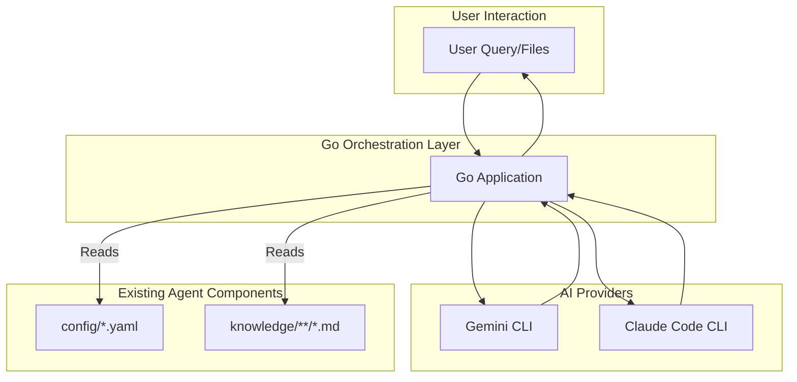

# Product Future: Enhancing the Design Agent

## 1. Introduction

This document outlines two potential futures for the Design Agent: an "Enhanced Agentic Implementation" that builds upon the existing architecture, and a "Full AI Implementation" that transitions the agent to a more dynamic and intelligent system. Both scenarios are designed to minimize refactoring by leveraging a stack that is a natural match for the current implementation and to exclusively use the Gemini and Claude Code CLIs for AI provider integration.

## 2. Guiding Principles

*   **Minimize Refactoring**: All recommendations are designed to work with the existing file-based architecture.
*   **No NPM, Python, or Node.js**: The proposed stack will be based on technologies that do not require these runtimes.
*   **CLI-Based AI**: The agent will interact with AI providers through their 0auth-enabled CLIs, eliminating the need for API key management.

## 3. Core Technology Recommendation: Go

For both the Enhanced Agentic and Full AI implementations, **Go (Golang)** is the recommended programming language.

### Why Go?

*   **Compiled and Statically Typed**: Go is a compiled language, which results in high-performance, single-binary applications. This simplifies deployment and eliminates the need for a runtime environment like Node.js or Python.
*   **Excellent Concurrency**: Go's built-in support for concurrency (goroutines and channels) is ideal for managing multiple tasks and interacting with external services like CLIs.
*   **Strong Standard Library**: Go's standard library includes robust support for file I/O, networking, and executing external commands, which are all essential for this project.
*   **Cross-Platform Compilation**: Go can be easily cross-compiled to run on any major operating system, making it highly portable.

## 4. Scenario 1: Enhanced Agentic Implementation

This scenario focuses on augmenting the existing agent's capabilities with a Go-based orchestration layer that interacts with the Gemini and Claude Code CLIs.

### Architecture



### Implementation Steps

1.  **Develop a Go application** that serves as the main entry point for the agent.
2.  **Implement file parsing logic** in Go to read the `agents.yaml` and `tasks.yaml` files, as well as the content of the `/knowledge` directory.
3.  **Create a command execution module** in Go that can call the Gemini and Claude Code CLIs with the appropriate prompts and arguments.
4.  **Develop a response synthesis module** in Go that can parse the output from the CLIs and generate a final, contextualized response.

### Code Example: Executing a CLI Command in Go

```go
package main

import (
    "fmt"
    "os/exec"
)

func runClaudeCLI(prompt string) (string, error) {
    cmd := exec.Command("claude", "code", "-p", prompt)
    output, err := cmd.CombinedOutput()
    if err != nil {
        return "", fmt.Errorf("error running claude cli: %w", err)
    }
    return string(output), nil
}

func main() {
    prompt := "Explain the difference between a goroutine and a thread."
    response, err := runClaudeCLI(prompt)
    if err != nil {
        fmt.Println("Error:", err)
        return
    }
    fmt.Println("Claude's Response:", response)
}
```

## 5. Scenario 2: Full AI Implementation

This scenario envisions a more advanced agent that can learn, adapt, and even modify its own knowledge base and configuration files over time.

### Architecture

The architecture for the Full AI Implementation is similar to the Enhanced Agentic Implementation, but with the addition of a **feedback loop** that allows the agent to update its own files.

```mermaid
graph TD
    subgraph User Interaction
        A[User Query/Files]
        G[User Feedback]
    end

    subgraph Go Orchestration and Learning Layer
        B[Go Application with Learning Module]
    end

    subgraph AI Providers
        C[Gemini CLI]
        D[Claude Code CLI]
    end

    subgraph Agent Components (Read/Write)
        E[config/*.yaml]
        F[knowledge/**/*.md]
    end

    A --> B;
    B --> C;
    B --> D;
    B -- Reads/Writes --> E;
    B -- Reads/Writes --> F;
    C --> B;
    D --> B;
    B --> A;
    G --> B;
```

### Implementation Steps

1.  **Build upon the Enhanced Agentic Implementation**: The Go application from the previous scenario serves as the foundation.
2.  **Develop a "learning module"** in Go that can analyze the success of the agent's responses based on user feedback or other metrics.
3.  **Implement file writing capabilities**: The learning module will need to be able to modify the `.yaml` and `.md` files in the `/config` and `/knowledge` directories.
4.  **Use AI for self-improvement**: The agent can use the Gemini or Claude Code CLIs to generate new task guides, update agent definitions, or even suggest improvements to its own code.

### Code Example: Updating a Task Guide in Go

```go
package main

import (
    "fmt"
    "io/ioutil"
    "os/exec"
)

// Function to get a suggestion for improving a task guide
func getImprovementSuggestion(taskGuideContent string) (string, error) {
    prompt := fmt.Sprintf("Given the following task guide, suggest an improvement:\n\n%s", taskGuideContent)
    cmd := exec.Command("gemini", "text", "-p", prompt)
    output, err := cmd.CombinedOutput()
    if err != nil {
        return "", fmt.Errorf("error running gemini cli: %w", err)
    }
    return string(output), nil
}

// Function to update the task guide file
func updateTaskGuide(filePath string, newContent string) error {
    return ioutil.WriteFile(filePath, []byte(newContent), 0644)
}

func main() {
    filePath := "knowledge/task_guides/usability_test_planning.md"
    content, err := ioutil.ReadFile(filePath)
    if err != nil {
        fmt.Println("Error reading file:", err)
        return
    }

    suggestion, err := getImprovementSuggestion(string(content))
    if err != nil {
        fmt.Println("Error getting suggestion:", err)
        return
    }

    fmt.Println("Suggested Improvement:", suggestion)

    // In a real implementation, you would likely have a more sophisticated
    // way of incorporating the suggestion into the file.
    // For this example, we'll just append it.
    newContent := string(content) + "\n\n## Suggested Improvement\n\n" + suggestion
    err = updateTaskGuide(filePath, newContent)
    if err != nil {
        fmt.Println("Error updating file:", err)
        return
    }

    fmt.Println("Task guide updated successfully!")
}
```

## 6. Conclusion

By leveraging Go and the existing CLI tools for Gemini and Claude, the Design Agent can be significantly enhanced without a complete rewrite. The Enhanced Agentic Implementation offers a near-term path to a more powerful agent, while the Full AI Implementation provides a long-term vision for a truly intelligent and self-improving system. Both approaches align with the core principles of minimizing refactoring and avoiding restricted technologies.
