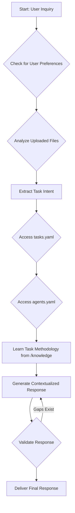
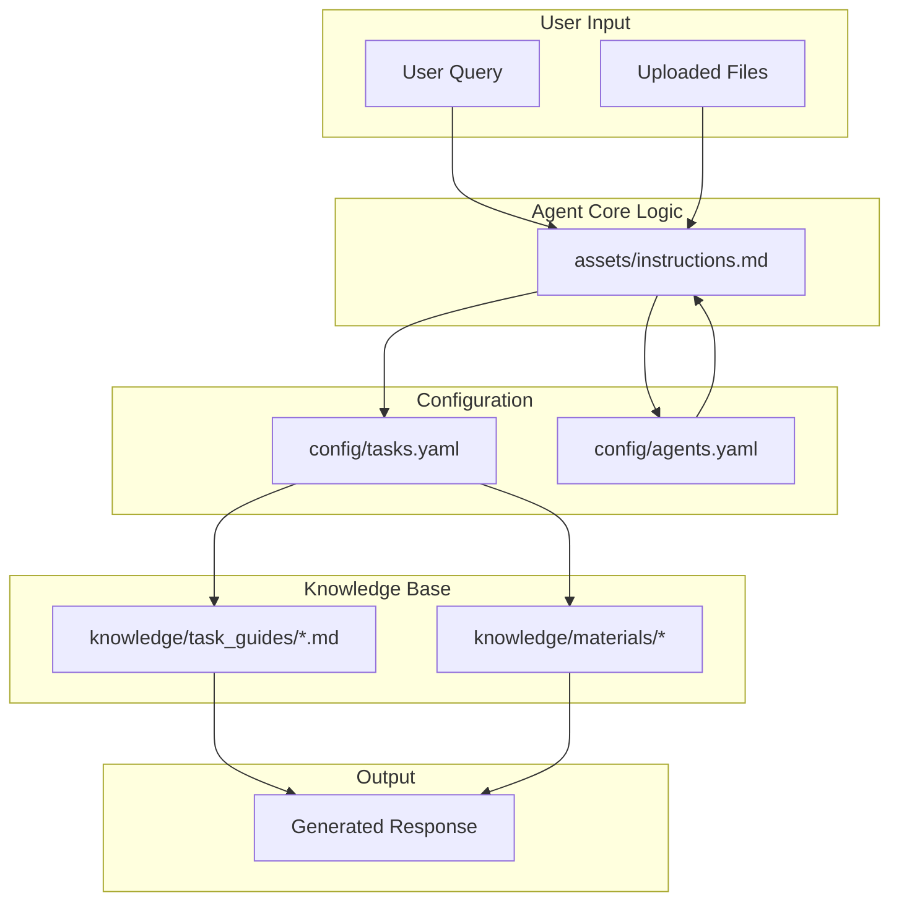

# Product Map: Design Agent

## 1. Introduction

This document provides a comprehensive map of the Design Agent, a sophisticated system designed to assist with a wide range of product design tasks. The agent leverages a modular architecture, combining a knowledge base, configuration files, and a set of specialized "agents" to provide contextualized and actionable guidance.

## 2. Core Components

The agent's functionality is derived from three core directories:

*   **`/assets`**: Contains the core instructions and logic for the agent's behavior.
*   **`/config`**: Defines the available agents and tasks, mapping capabilities to specific actions.
*   **`/knowledge`**: A repository of task-specific guides and supplementary materials that form the agent's knowledge base.

## 3. Agentic Workflow

The agent follows a systematic process to handle user inquiries, ensuring a comprehensive and context-aware response.

### Workflow Steps:

1.  **Check User Preferences**: The agent first looks for a `user_preferences` file to customize its behavior.
2.  **Analyze Uploaded Files**: If any files are provided by the user, the agent analyzes them for project context, requirements, and constraints.
3.  **Extract Task Intent**: The agent parses the user's query to identify the core task.
4.  **Access `tasks.yaml`**: The agent consults `config/tasks.yaml` to find a matching task definition.
5.  **Access `agents.yaml`**: The agent uses `config/agents.yaml` to identify the appropriate specialized agent for the task.
6.  **Learn Task Methodology**: The agent accesses the relevant task guides and materials from the `/knowledge` directory.
7.  **Generate Contextualized Response**: The agent synthesizes the information from the knowledge base and the user-provided context to generate a response.
8.  **Validate Response**: The agent runs a validation checklist to ensure the response is complete and accurate.
9.  **Deliver Final Response**: The agent delivers the final, validated response to the user.

## 4. Agent Definitions

The agent's capabilities are distributed among a team of specialized agents, each with a distinct role, goal, and set of tools. These are defined in `config/agents.yaml`.

| Agent Role | Goal | Key Capabilities |
| :--- | :--- | :--- |
| **AI Specialist** | Operationalize AI across design workflows. | Prompt engineering, AI output evaluation, automation. |
| **Collaboration Facilitator**| Orchestrate effective communication and decision-making. | Critiques, workshops, stakeholder mapping. |
| **Content Specialist** | Ensure clarity, consistency, and accessibility of artifacts. | Content audits, information architecture, SEO. |
| **Design Educator** | Raise design maturity through education programs. | Curriculum design, reference guides, workshops. |
| **Design System Specialist**| Create and govern the design system. | Component specs, token management, accessibility audits. |
| **Discovery Analyst** | Clarify problem spaces and opportunity areas. | Journey mapping, hypothesis crafting, evidence gathering. |
| **Onboarding Specialist**| Ramp up new designers and leads. | Onboarding plans, tool training, progress tracking. |
| **Project Manager** | Deliver initiatives predictably. | Scoping, planning, risk management. |
| **Requirements Analyst** | Transform concepts into comprehensive PRDs. | Requirements gathering, user stories, technical specs. |
| **Research Analyst** | Plan, execute, and synthesize research. | Usability testing, measurement frameworks, data analysis. |
| **Strategy Analyst** | Translate opportunities into coherent strategies. | KPI trees, prioritization, roadmaps. |
| **Team Lead** | Build and lead high-performing design teams. | Staffing, performance management, culture development. |
| **Visual Designer** | Elevate product aesthetics and clarity. | Visual storytelling, asset creation, AI image prompting. |

## 5. Task Definitions

The agent can perform a wide range of tasks, each defined in `config/tasks.yaml`. Each task definition includes a description, expected output, a designated agent, and links to relevant task guides and materials.

**Example Task: `usability_test_planning`**

*   **Description**: Create a comprehensive usability test plan.
*   **Expected Output**: A test plan document including research questions, task scenarios, and a moderator guide.
*   **Agent**: `research_analyst`
*   **Task Guides**: `test_plan.md`, `recruiting_users.md`, etc.
*   **Materials**: `product_metrics_list.csv`, `cognitive_biases_list.csv`

## 6. Knowledge Base

The `/knowledge` directory is the heart of the agent's expertise. It is organized into two subdirectories:

*   **`/task_guides`**: Contains detailed, step-by-step instructions for completing each task defined in `config/tasks.yaml`.
*   **`/materials`**: Provides supplementary resources, such as templates, checklists, and data files, to support task execution.

## 7. File-Based Workflows

The agent's behavior is not hard-coded but rather emerges from the interaction of its configuration and knowledge base files. This allows for a highly modular and extensible system.

This diagram illustrates how the agent's core logic in `assets/instructions.md` orchestrates the use of the configuration files (`tasks.yaml`, `agents.yaml`) and the knowledge base to process user input and generate a response.
